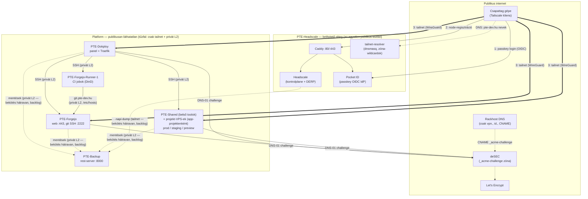
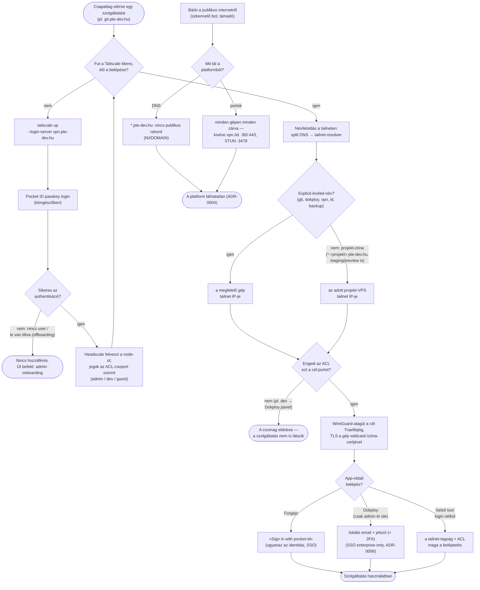
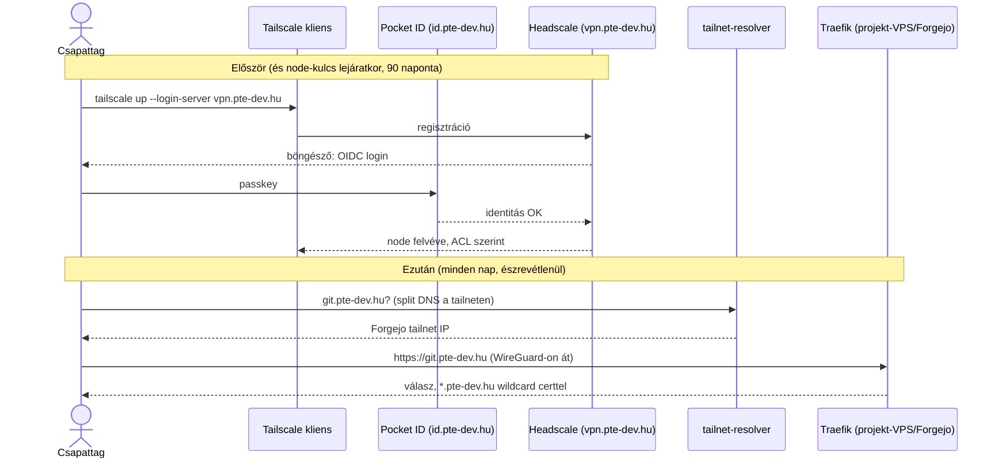
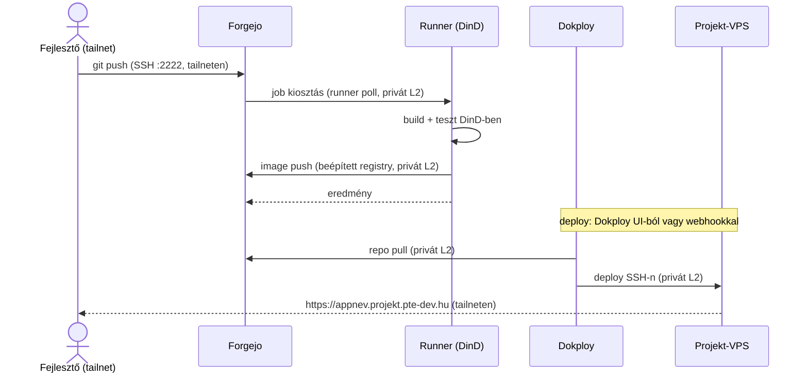
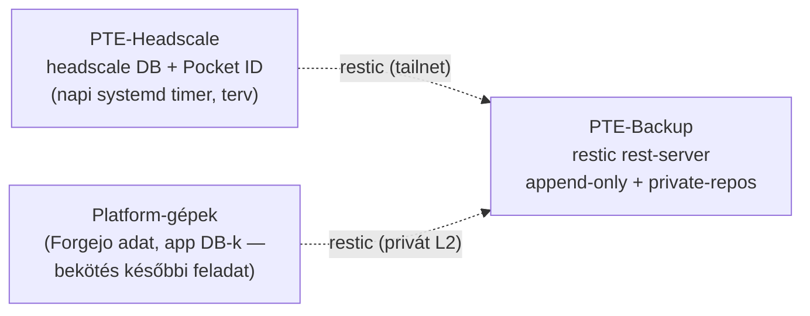

# Platform-architektúra és működési flow-k

A PTE dev platform célállapota az ADR-0004–0009 döntései után: **hálózati
láthatatlanság** — a platformnak nincs publikus portja, kifelé csak a
beléptető réteg létezik. Ez a dokumentum a teljes működést írja le; a
fogalmak a [CONTEXT.md](../CONTEXT.md)-ben, a kézi eljárások a runbookokban,
az átállás a [runbooks/vpn-atallas.md](runbooks/vpn-atallas.md)-ben.

| Döntés                                                        | ADR                                                         |
| ------------------------------------------------------------- | ----------------------------------------------------------- |
| VPN (Headscale) az egész platform elé                         | [0004](adr/0004-halozati-lathatatlansag-headscale-vpn.md)   |
| Kétszintű hálózat: privát L2 + tailnet                        | [0005](adr/0005-ketszintu-halozat-privat-l2-es-tailnet.md)  |
| Pocket ID az egyetlen identitásforrás                         | [0006](adr/0006-pocket-id-egyetlen-identitasforras.md)      |
| Wildcard cert (deSEC DNS-01) + split DNS                      | [0007](adr/0007-wildcard-cert-desec-delegalas-split-dns.md) |
| Dedikált backup gép, restic append-only                       | [0008](adr/0008-dedikalt-backup-vps-restic-append-only.md)  |
| Projektenként dedikált VPS + env-zónák (prod/staging/preview) | [0009](adr/0009-projektenkent-dedikalt-vps-es-env-zonak.md) |

## Gépek és hálózatok

| VPS                                                        | Szerep                                                                      | Privát L2 | Tailnet | Publikus port     |
| ---------------------------------------------------------- | --------------------------------------------------------------------------- | --------- | ------- | ----------------- |
| PTE-Headscale                                              | beléptető réteg: Headscale + Pocket ID + tailnet-resolver                   | —         | ✓       | 80, 443, 3478/udp |
| PTE-Dokploy                                                | Dokploy panel + Traefik                                                     | ✓         | ✓       | —                 |
| PTE-Forgejo                                                | Forgejo + Traefik + git SSH (host 2222)                                     | ✓         | ✓       | —                 |
| PTE-Forgejo-Runner-1                                       | Forgejo Runner (DinD)                                                       | ✓         | ✓       | —                 |
| PTE-Shared                                                 | a csapat saját belső tooljai (infra; technikailag projekt-sablon) + Traefik | ✓         | ✓       | —                 |
| PTE-\<Projekt\> (app-projektenként egy, már az indulástól) | a projekt app-jai mindhárom env-vel (prod/staging/preview) + Traefik        | ✓         | ✓       | —                 |
| PTE-Backup                                                 | restic rest-server (append-only) — **még nincs felhúzva** (backlog 2.)     | ✓         | ✓       | —                 |

### Docker image-ek

A verzió-pinek forrás-igazsága a service-fájlok (cloud-init compose-blokk
vagy docker-compose.yml) — központi verzió-táblát szándékosan nem tartunk,
az csak driftelne. Aktuális lista lekérdezése:

```bash
grep -rn "image:" services/ --include="*.yml" --include="*.yaml"
```

**Megkötések minden image-re:**

1. **Csak hivatalos image, és a legkanonikusabb csatornáról**: Docker
   Official Image (`caddy`, `postgres`, `docker`) vagy az upstream projekt
   saját, a projekt nevét viselő registry-je/org-ja
   (`headscale/headscale`; `ghcr.io/pocket-id/pocket-id`;
   `codeberg.org/forgejo/forgejo`; `data.forgejo.org/forgejo/runner`;
   `restic/rest-server`). Ha a projekt több hivatalos helyre publikál, a
   projekt-nevű org-ot választjuk (ezért `headscale/headscale`, nem a
   szintén hivatalos `ghcr.io/juanfont/headscale`). Third-party rebuild
   tilos; kétes esetben az upstream telepítési doksija dönt arról, mi
   számít hivatalosnak.
2. **Alpine-variáns, ahol létezik** (`caddy:*-alpine`, `postgres:*-alpine`);
   a többi pinnelt image eleve alpine- vagy distroless-alapú.
3. Pin-bump menete és changelog-check: az adott service runbookjának
   „Frissítés" szakasza.

Két, szándékosan szétválasztott hálózati szint (ADR-0005):

- **Tailnet** (WireGuard mesh, 100.64.0.0/10): az **ember → szerver** forgalom.
- **Privát L2** (Rackforest, 10.10.0.0/24): a **szerver ↔ szerver** forgalom —
  a platform belső működése (deploy, CI, mentés) a beléptető réteg
  kiesésekor is megy.

## Topológia



## Folyamatábra — egy kérés útja, döntési pontokkal

Mi történik attól, hogy valaki beír egy `pte-dev.hu` alatti címet, addig, hogy
használja a szolgáltatást — és hol akad el, akinek nem szabad bejutnia:



A kulcs-tulajdonság, amit az ábra mutat: **négy egymástól független kapu van**
(Pocket ID identitás → headscale node → ACL → app-oldali auth), és aki a
tailneten kívül áll, az az elsőig sem jut el — számára se név, se port nem
létezik.

## 1. flow — Csapattag-hozzáférés (a mindennapi belépés)



Kulcspontok:

- **Egy identitás mindenhez** (ADR-0006): a VPN-belépés és a Forgejo „Sign in
  with pocket-id” ugyanaz a Pocket ID user. A Dokploy panel kivétel (lokális
  login, enterprise-only SSO) — de azt hálózati szinten is csak admin éri el.
- **ACL** (háromszintű, [acl-policy.hujson](../services/headscale/acl-policy.hujson)):
  admin → minden; dev → Forgejo + belső toolok + projekt-VPS-ek; guest →
  csak a meghívott projekt(ek) gépe (ADR-0009). Port-szintű: projekten belüli
  per-app guest-korlátozás app-oldali OIDC-vel oldható meg.
- A VPN-en kívülről a nevek fel sem oldódnak, a portok nem válaszolnak.

## 2. flow — Fejlesztés: push → CI → deploy



- A runner a `git.pte-dev.hu`-t `/etc/hosts`-ból a Forgejo **privát L2**
  címén éri el — a CI a beléptető réteg kiesésekor is zöld (ADR-0005).
- **Docker registry** = a Forgejo beépített OCI registry-je
  (`git.pte-dev.hu/<owner>/<image>`): a CI oda pushol, a Dokploy-gépek onnan
  pullolnak, mind a privát L2-n — külön registry-szolgáltatás nincs
  (services/forgejo/RUNBOOK.md, Container registry szakasz).
- A CI jobok a DinD-ben futnak, a Dokploy által kezelt host Dockerhez nem
  érnek hozzá (ADR-0003).

## 3. flow — Projektek, environmentek, új app publikálása

Minden app-projekt **már az indulástól** dedikált VPS-en él, mindhárom
környezetével (ADR-0009). A PTE-Shared nem app-projekt: az a csapat saját
belső tooljainak infra-gépe, csak technikailag követi ugyanezt a sablont.

A névséma forrás-igazsága az
[ADR-0009](adr/0009-projektenkent-dedikalt-vps-es-env-zonak.md) táblája.
Prod és staging deployt a Dokploy intézi; a preview (ephemeral, PR-enként)
Forgejo Actions + Dokploy API glue — későbbi feladat, a Dokploy natív
preview-ja GitHub-only ([docs/backlog.md](backlog.md)).

**Új app egy meglévő projektben — nulla kézi DNS/cert lépés:**

1. Dokploy: Create Service a projekt szerverére, domain a névséma szerint,
   certificate: **none**.
2. **DNS**: a projekt-zóna egyetlen resolver-sora
   (`address=/<projekt>.pte-dev.hu/<IP>`) minden env-et, minden mélységben
   fed — nincs teendő.
3. **TLS**: a projekt-VPS Traefikjének zóna-certje (3 env-wildcard SAN) már
   fedi — nincs teendő. A cert DNS-01-gyel újul: Traefik → deSEC API → TXT
   rekord → Let's Encrypt. App-név nem kerül CT-logba (ADR-0007).
4. Az app azonnal elérhető minden tailnet-tagnak, akit az ACL enged — a
   guest-hozzáférés projekt-szintű: a vendég csak a meghívott projekt gépét
   éri el.

**Új projekt — egyszeri, ~15 perces esemény**: VPS cloud-initből, Dokploy
remote server, tailnet-join, egy resolver-sor, egy ACL-bejegyzés, három
Rackhost CNAME, Traefik zóna-cert. Részletek:
[services/projekt/RUNBOOK.md](../services/projekt/RUNBOOK.md).

## 4. flow — Mentés és helyreállítás



- **Jelen állapot**: a teljes flow terv — a PTE-Backup gép még nincs
  felhúzva, egyetlen mentés sem fut ([backlog 2. tétel](backlog.md)).
- **Append-only**: a küldő gép csak írni tud — kompromittált gép nem
  semmisítheti meg a saját mentéseit; retention a backup gépen fut (ADR-0008).
- A restic kliens-oldalon titkosít; a repo-jelszavak a gépeken KÍVÜL is
  megvannak (jelszókezelő).
- Beléptetőréteg-halál helyreállítása: friss VPS cloud-initből + dump
  visszatöltés, cél ~1 óra
  ([services/headscale/RUNBOOK.md](../services/headscale/RUNBOOK.md),
  Helyreállítás).

## 5. flow — Break-glass (mi van, ha valami kiesik?)

| Kiesés                        | Hatás                                                                                                                                     | Menekülőút                                                      |
| ----------------------------- | ----------------------------------------------------------------------------------------------------------------------------------------- | --------------------------------------------------------------- |
| Egy platform-gép tailscale-je | csak az a gép nem elérhető embernek                                                                                                       | SSH a szomszéd gépről privát L2-n; végső esetben Rackforest VNC |
| Beléptető réteg (teljes gép)  | senki nem lép be sehova; **a platform fut tovább** (deploy, CI, mentés a privát L2-n megy); élő WireGuard-kapcsolatok egy ideig még élnek | Rackforest VNC → helyreállítás dumpból (4. flow)                |
| Forgejo                       | CI és git áll; a VPN-t NEM érinti (az identitás a Pocket ID-ban van)                                                                      | Dokploy-ból redeploy; `forgejo-admin` lokális fiók él           |
| Dokploy                       | deploy áll; futó app-ok, git, CI megy                                                                                                     | VNC/SSH; a compose-ok forrás-igazsága ez a repo                 |
| Rackforest telephely          | minden áll                                                                                                                                | ismert korlát: off-site mentés későbbi bővítés (ADR-0008)       |

Az elv (ADR-0005): _a platform függhet a beléptető rétegtől, a beléptető
réteg nem függhet a platformtól_ — és egyik javítási út sem vezet át azon a
rétegen, amit éppen javítani kell.

## 6. flow — Onboarding / offboarding

**Onboarding** (~5 perc): Pocket ID user + ACL-csoport a repóban + a tag
gépén `tailscale up` és passkey-regisztráció — utána minden jogosult
szolgáltatást elér.

**Offboarding** (~2 perc, formális audit-kényszer nincs): Pocket ID-letiltás
(Forgejo login és VPN re-auth egyszerre hal meg) + `headscale nodes expire` +
ACL-csoportból kivétel.

A lépések gazdája:
[services/headscale/RUNBOOK.md](../services/headscale/RUNBOOK.md),
Onboarding/offboarding szakasz.
